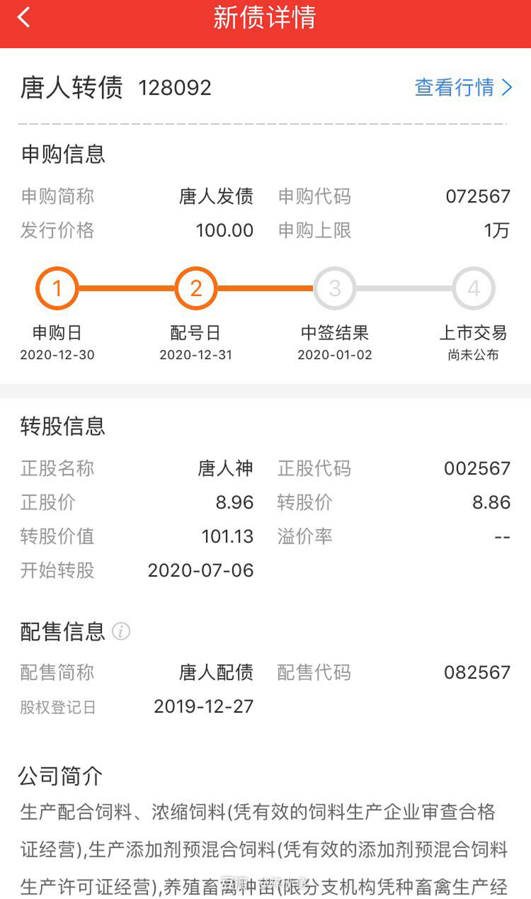
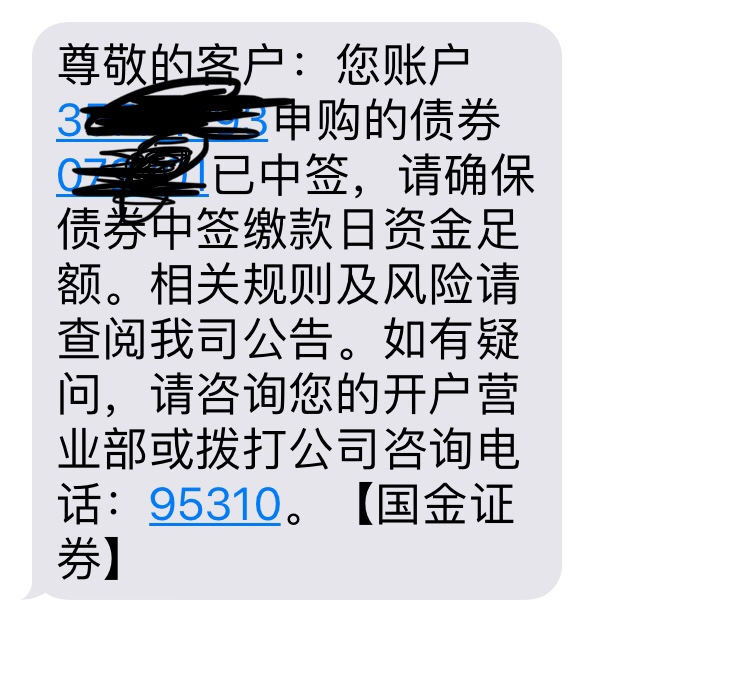
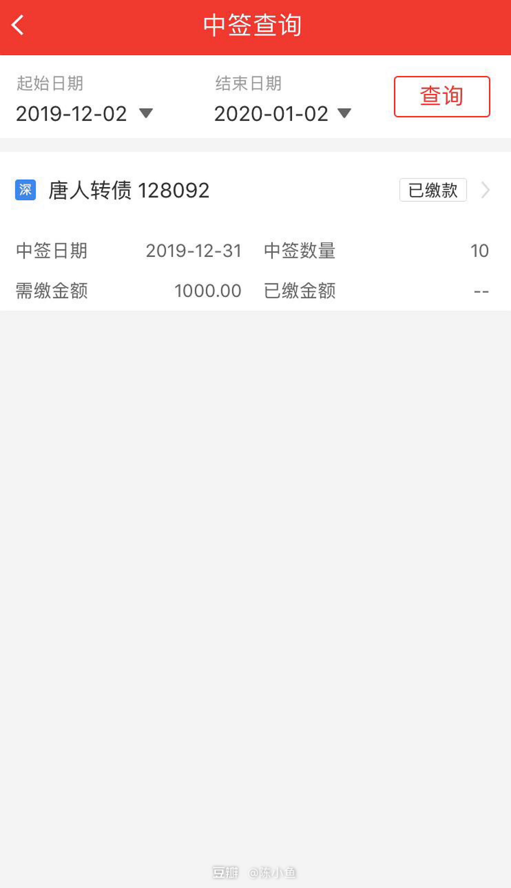
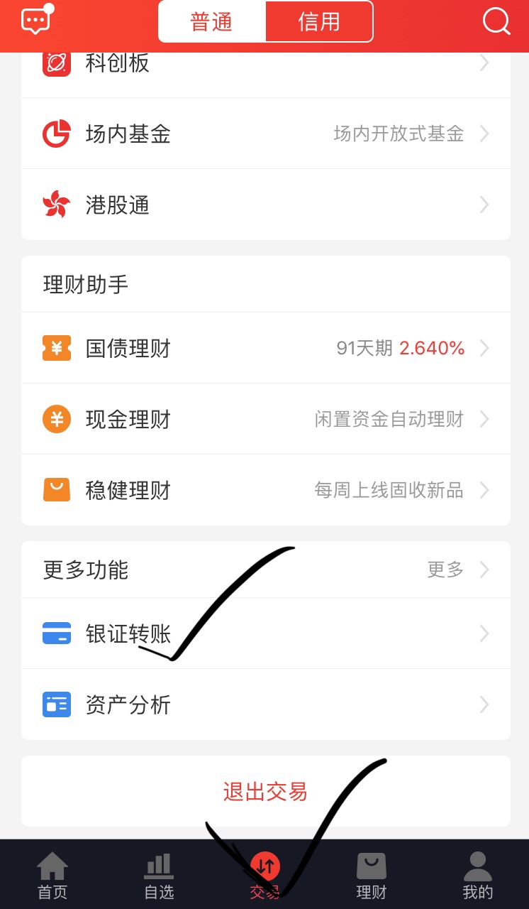
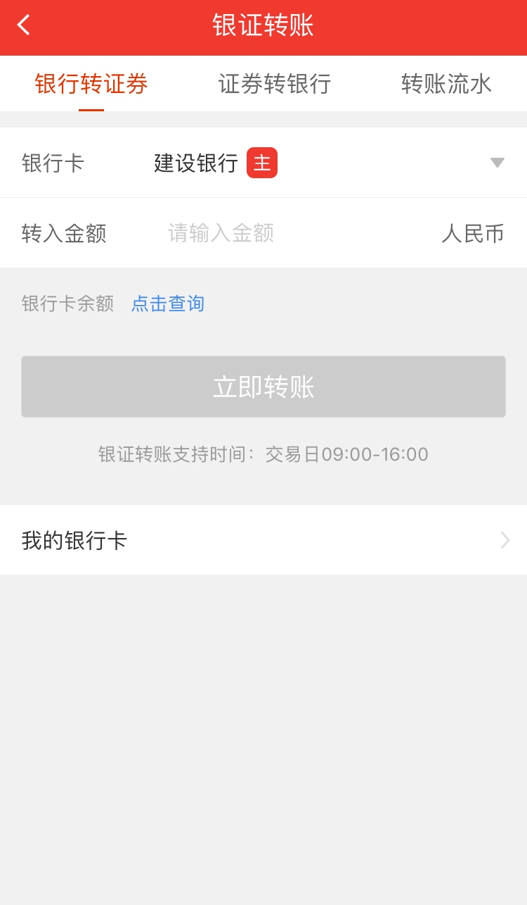
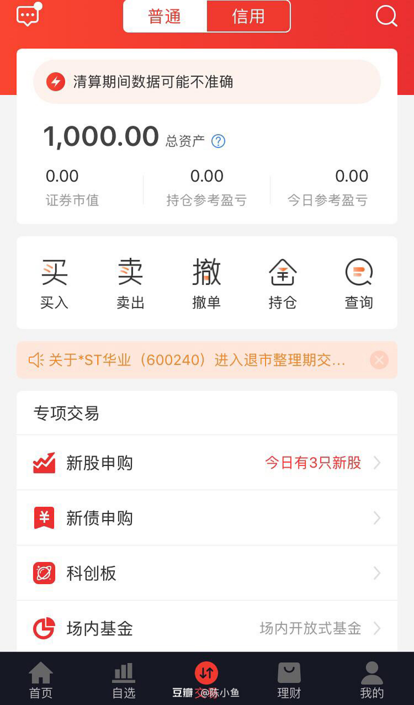
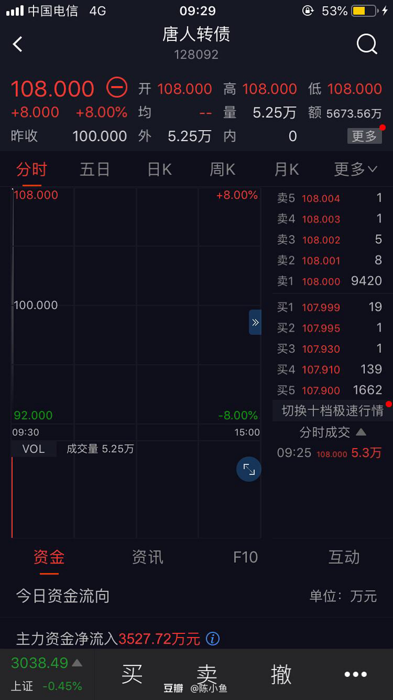
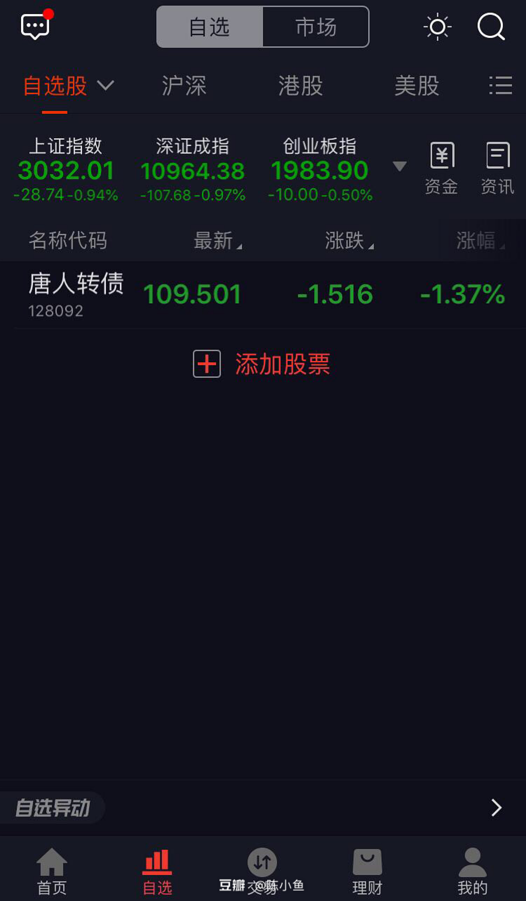
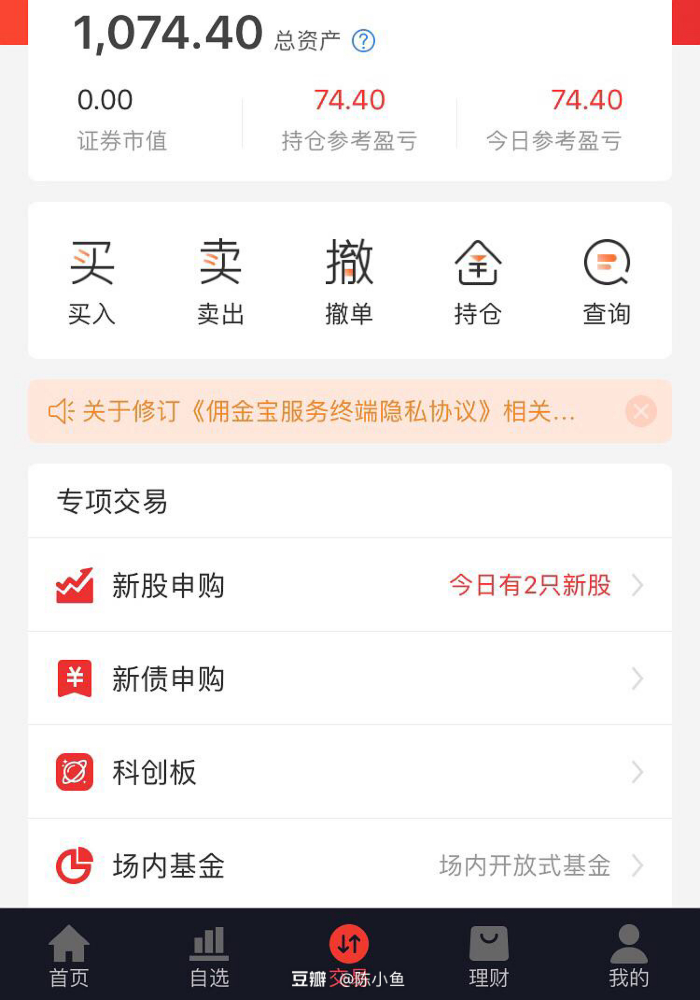

# 可转债新手操作指南

申购可转债新债总体而言是安全的，而且简单，基本没有技术含量。
本文简单记录一下我此次的操作步骤。我是在国金证券的App--佣金宝上操作的，其他证券App我不了解。

## 申购前
关注建议申购的可转债，关注申购日期，申购日当天，选择默认申购数，根据经验，中10签（1000元）已经很不错了。

## 申购完
App显示，申购完隔一天，第三天即可知道中签结果，但第二天晚上11点左右，就可收到证券公司的短信通知(只有中签了才会有通知)

## 中签缴款
第三天早上9点，App上就可看到自己的中签情况，根据需缴金额缴款，选择交易--更多功能--银证转账--银行转证券，钱转进去就没事了，坐等转债上市。

## 等待上市
一般上市平均20天，半月之后，可经常登录App，查看上市日。

## 上市交易
上市当天，9：20左右可能开始就有报价，但9：30才可以正式买卖。在自选里添加转债代码，开始报价吧。一般报价都在100元以上（即使暂时还未达到100，也耐心等一等），若是101元成交，则赚（101-100）× 10 = 10 元，若是110元成交，则赚（110-100）× 10 = 100元。成交后，总资产就变啦，你可以把钱一直放里面，也可以转出来，但得在第二天9-16点（交易日是周一至周五的9-16点，不包括节假日） （交易--更多功能--银证转账--证券转银行）。

## 总结
**可转债总体而言是非常容易上手，简单，安全的理财方式**，不到一个月的时间就可以赚几十一百来块，利润比余额宝要高。唯一的缺点就是**中签率不高**，不是每次申购都会中，一旦中了还是挺幸运的。

*以上内容不作为投资建议，股市有风险，投资需谨慎。*
